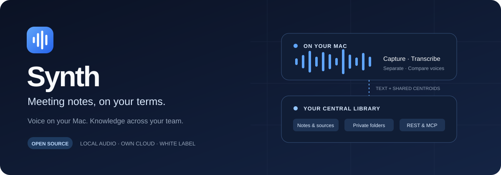
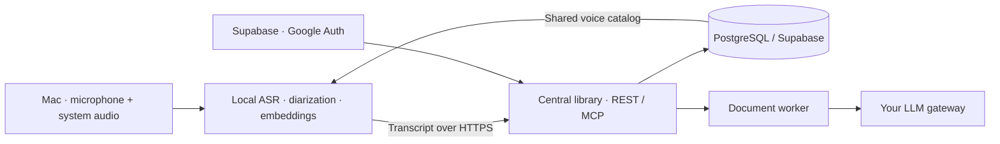

<div align="center">



<br />

**An open source meeting notebook. A central library you control.**

<p>
  <a href="LICENSE.md"></a>
  <a href="https://github.com/AlexHHPS/synth/actions/workflows/synth-checks.yml"></a>
  <a href="docs/synth/installation.md"></a>
  <a href="docs/synth/white-label.md"></a>
</p>

[Get started](docs/synth/installation.md) ·
[Architecture](docs/synth/architecture.md) ·
[API & MCP](docs/synth/integrations.md) ·
[Make it yours](docs/synth/white-label.md) ·
[Security](docs/synth/security.md)

</div>

---

Capture a quick thought, an in-person conversation or a remote meeting.
Synth turns it into a transcript and structured notes you can revisit, share
and use from other systems.

The audio stays on your Mac. Your central library holds the knowledge.

## From conversation to context

| Capture naturally | Find what matters | Connect your tools |
| :--- | :--- | :--- |
| Microphone and system audio, without a meeting bot. Live transcription and notes while you speak. | Summaries, decisions, tasks and open questions, with references back to transcript segments. | Private folders, explicit sharing and authenticated REST/MCP access to the central library. |

- **Quick notes count.** A single speaker is a valid recording; diarization is not a prerequisite for a useful note.
- **Voices have context.** Enroll locally and choose whether to share an encrypted voice centroid. Matching runs on the Mac and proposes provisional candidates.
- **Every result has a source.** Document references point to the transcript version used to generate them.
- **Work survives interruptions.** Processing checkpoints, retries and current-version checks keep older jobs from replacing newer results.
- **Your team gets one library.** Employees sign in through your Supabase Google Auth configuration; integrations get read-only, folder-scoped keys.
- **Your product has its own identity.** Configure the name, mark, accent, bundle identifier, product links and approved backend before building.

## Local audio. Your cloud. Your AI gateway.



| On the Mac | In your central deployment |
| :--- | :--- |
| Capture, live ASR, diarization, enrollment and voice comparison. | Library text, versions, permissions, document jobs and encrypted shared centroids. |
| Temporary audio, deleted after analysis; interrupted audio expires within 24 hours while the host runs. | HTTPS API/MCP and your configured document worker. No recording upload endpoint. |
| Local voice profiles encrypted with a Keychain-protected key. | Shared centroids encrypted with a server key kept outside the database. |

Only text goes to the configured LLM gateway. That gateway may use external
providers: Synth does not claim that summaries are fully local. Shared profiles
are available to authorized employee clients for comparison; this is controlled
organizational sharing, not end-to-end encryption against the server operator.

[Explore the architecture →](docs/synth/architecture.md)

## Get started

The current complete pipeline targets **Apple Silicon, macOS 14+ and Spanish**.
Deploy one instance per organization. Use your own Supabase project for Google
Auth/PostgreSQL and a container host for the API and document worker.

```sh
git clone https://github.com/AlexHHPS/synth.git
cd synth
git submodule update --init --recursive
```

Follow the [complete installation guide](docs/synth/installation.md) to prepare
the pinned acoustic models, source-built FFmpeg, native app and portable host.
A configured backend is required. Packaged users do not need Python, Rust or Xcode.

**Release status:** source and build tooling are available. A published installer,
Developer ID signature and notarization are not yet provided. Windows/Linux code
is inherited, but the complete Synth pipeline is not validated there.
See the [readiness checklist](docs/synth/readiness.md).

## Build your own edition

```sh
python3 scripts/configure-brand.py \
  --name "Example Voice" --identifier dev.example.voice \
  --accent "160 70% 35%" --logo /example-mark.svg --generate-icons \
  --api-url https://voice.example.com \
  --supabase-url https://exampleproject.supabase.co \
  --source-url https://example.com/source \
  --documentation-url https://example.com/docs \
  --support-url https://example.com/support
```

Replace the examples with your own origins and links. The configuration updates
UI identity, About, bundle metadata, native icons, app-data namespaces and the
approved backend. Rebuild the native client and packaged host together.
Keep credentials in server secrets, never in branding files.

[White label build guide →](docs/synth/white-label.md)

## Give other systems the context

Point your REST or MCP client at the central service. The recording Mac does not
need to stay online for other systems to read completed library entries.

| REST | MCP |
| :--- | :--- |
| `https://voice.example.com/v1` | `https://voice.example.com/mcp` |
| Bearer token; employee session or scoped integration key. | Authenticated Streamable HTTP with the same scopes. |
| Transcripts, notes, summaries, versions, status and search. | Ten library tools, including `get_transcript`, `get_document` and `search_transcripts`. |

Requests without valid credentials are denied. Integration keys cannot upload,
edit meetings or read the voice catalog. See [client setup and endpoints](docs/synth/integrations.md).

## Built with verification

The automated checks cover processing state, transcript recovery, citation
validation, identity matching contracts, access control and white label configuration.
CI builds the frontend and service image and audits public source.

The local verification also exercises the library through real HTTP and the
official MCP SDK, plus synthetic audio through the packaged acoustic pipeline.
Synthetic tests verify the circuit; they do not establish human recognition accuracy.

Voice names remain **provisional until independently calibrated**. Test real
enrollment and calls before relying on recognition. See
[voice calibration](docs/synth/voice-calibration.md) and [security](docs/synth/security.md).

## Open source, with clear origins

Synth derives from **Meetily Community Edition**, created by Zackriya Solutions,
under the [original MIT license](LICENSE.md). It is an independent product with
its own branding and added implementation; it is not an official Meetily release
or a license to Meetily Pro.

The original copyright and license remain intact. Dependencies and models retain
their own terms, including Apache 2.0, CC BY 4.0 and LGPL as applicable.
See [third-party notices](NOTICE.md) and the
[Community and redistribution policy](docs/synth/community-policy.md).

[Contribute](CONTRIBUTING.md) · [Report an issue](https://github.com/AlexHHPS/synth/issues)
