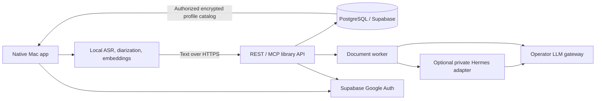

# Architecture

The native app owns recording permissions, separate microphone/system sources,
live text, quick notes and call-detection prompts. A detection prompts the user;
it does not authorize or start recording automatically.

The Mac host owns resumable acoustic stages, ASR, diarization, enrollment and
comparison of compatible voice embeddings. Audio is erased after acoustic
processing; the active host expires interrupted audio within 24 hours.
An offline/stopped host cannot execute a deletion timer. No raw recordings are
uploaded to the library, database or LLM gateway.

The API authorizes each folder, meeting, transcript and job before reading it.
PostgreSQL stores library text, immutable transcript/document versions, jobs,
permissions, hashed integration credentials and encrypted profile centroids.
Integration credentials are read-only and folder-scoped. Employees sign in with
Supabase Auth; allowed domains are configured by ALLOWED_DOMAINS.

Enrollment generates a normalized centroid locally. Sharing is explicit. The
server encrypts shared centroids using AES-GCM with a key outside the database;
authorized employee clients download the catalog over HTTPS and compare on the
Mac. Plain vectors exist transiently in RAM. Local profiles are encrypted with a
Keychain-protected key. This is controlled organizational sharing, not end-to-end
encryption against the server operator. Each deployment is a separate organization;
this code is not a multi-tenant hosted SaaS.

The worker processes the current transcript in chunks, binds references to exact
source segments, validates output and resumes validated checkpoints. A newer
transcript supersedes older queued jobs. Historical actas remain accessible only
through explicit version requests; an older running job cannot overwrite the
newer meeting state. Optional Hermes is a private, tool-free, isolated adapter.
Only text goes to the operator's configured gateway; that gateway may route to
external providers. The name of a combo does not prove local LLM execution.

Deploy API and worker on Railway or another container host using
synth/deploy/Dockerfile with different commands. Use a dedicated PostgreSQL or
Supabase database. Configure HTTPS, Auth and secrets following the security guide.
The Mac never contains a database password or a server encryption key.

See [voice-calibration.md](voice-calibration.md) for independent evaluation.
